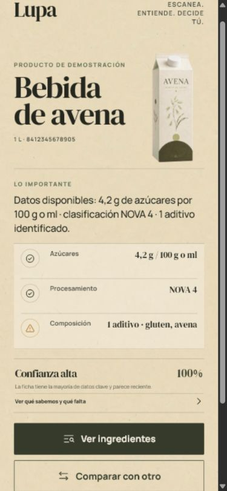

# Lupa

**Escanea. Entiende. Decide tú.**

Lupa es una aplicación web progresiva, libre e instalable, que lee códigos de barras de
productos alimentarios y convierte fichas colaborativas difíciles de interpretar en
evidencias claras. En vez de imponer una nota universal, separa lo conocido, lo que falta y
las preferencias personales.

**[Abrir e instalar Lupa](https://joel-oliva-domenech.github.io/lupa-productos/)**

No necesita registro. Funciona desde el navegador y puede instalarse en el móvil o el
ordenador como una app.

## Qué la hace diferente

- Escáner de cámara y lectura desde una fotografía, con ZXing ejecutándose en el dispositivo.
- Entrada manual con comprobación real del dígito de control GTIN.
- Datos de Open Food Facts con ingredientes, azúcares, NOVA, aditivos y alérgenos.
- Confianza de los datos basada en completitud, actualidad y avisos de calidad.
- Vista “qué sabemos / qué falta” para no convertir ausencias en falsas certezas.
- Preferencias privadas: términos a evitar guardados solo en el dispositivo.
- Comparación descriptiva entre dos productos, sin declarar un ganador automático.
- Historial y copia local de las últimas fichas para volver a consultarlas sin conexión.
- PWA instalable en Android, iOS y escritorio.
- Diseño móvil editorial, accesible y sin lenguaje alarmista.

## Probarla

La pantalla inicial permite:

1. Escanear con la cámara.
2. Leer una foto del código.
3. Escribir el GTIN manualmente.
4. Abrir un ejemplo ficticio que no representa ningún producto comercial.

La cámara necesita HTTPS o localhost. Lupa no sube la imagen de la cámara: solo envía el
número del código a Open Food Facts para obtener la ficha.

## Instalar como app

Abre la **[versión pública de Lupa](https://joel-oliva-domenech.github.io/lupa-productos/)**
y después:

- Android o escritorio: abre el menú del navegador y elige “Instalar aplicación”.
- iPhone o iPad: en Safari, pulsa Compartir y después “Añadir a pantalla de inicio”.
- Cuando el navegador lo permite, Lupa también muestra su propio botón “Instalar Lupa”.

## Desarrollo local

Requisitos: Node.js 20 o superior y pnpm.

~~~bash
pnpm install
pnpm assets
pnpm dev
~~~

Comprobación completa:

~~~bash
pnpm test
pnpm build
~~~

La compilación queda en la carpeta dist y contiene el manifiesto y el service worker.

## Arquitectura

- React y Vite para la interfaz.
- ZXing Browser para detectar EAN/UPC/GTIN.
- Open Food Facts API v3 para los datos colaborativos.
- vite-plugin-pwa y Workbox para instalación y caché.
- localStorage para historial, preferencias y copias de fichas.
- Vitest para las reglas de códigos y normalización de datos.

## Privacidad y límites

- Las preferencias y el historial se guardan localmente y no requieren una cuenta.
- Las fichas pueden estar incompletas o desactualizadas; el envase sigue siendo la fuente
  prioritaria.
- Lupa no ofrece consejo médico ni diagnostica alergias.
- La ausencia de un alérgeno en una ficha no demuestra que el producto no lo contenga.
- Las retiradas y alertas oficiales de AESAN no se consultan todavía en tiempo real.

## Datos y licencias

El código de Lupa se publica con licencia MIT. La base de datos de Open Food Facts se ofrece
bajo ODbL; sus contenidos individuales bajo Database Contents License y las imágenes de
productos bajo CC BY-SA. Consulta siempre las condiciones vigentes de Open Food Facts si
redistribuyes sus datos o imágenes.

Los recursos de demostración de Lupa son originales, ficticios y están incluidos como parte
del proyecto.

## Contribuir

Las mejoras son bienvenidas, especialmente:

- traducciones y accesibilidad;
- más fuentes oficiales de alertas;
- pruebas con nuevos formatos de códigos;
- explicaciones más claras sin simplificaciones engañosas;
- mejoras de rendimiento y funcionamiento sin conexión.

Lee [CONTRIBUTING.md](CONTRIBUTING.md) antes de abrir un cambio. Para vulnerabilidades, usa
[SECURITY.md](SECURITY.md).
